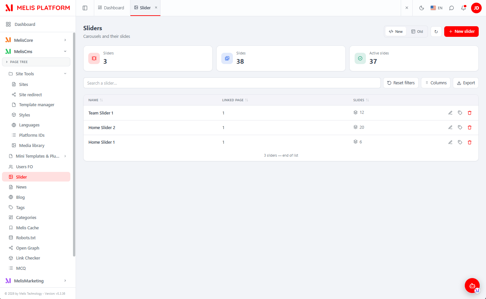
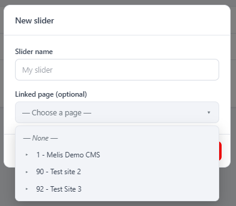
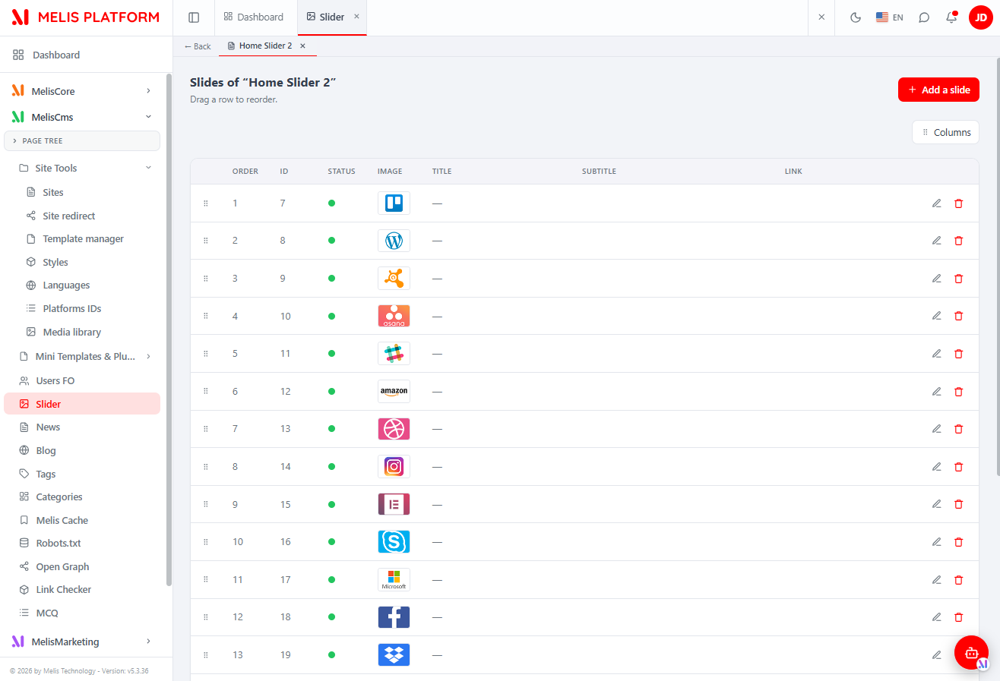
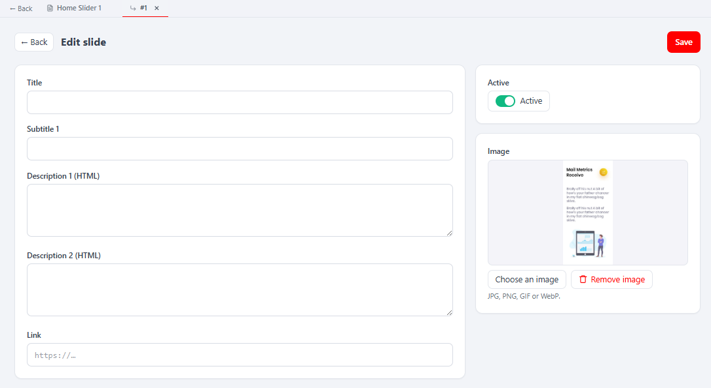
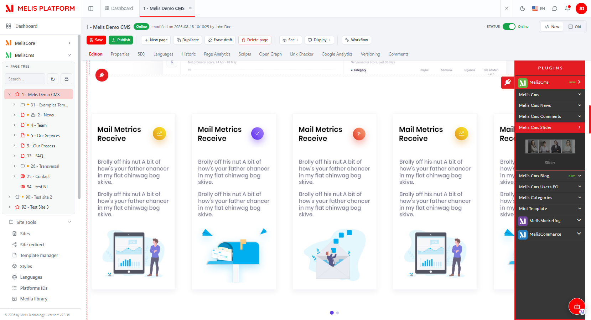
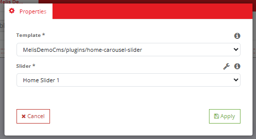

# MelisCmsSlider (React back-office) — Functional & Technical Documentation (for AI)

> **What this is.** MelisCmsSlider is the **slider / carousel** system of Melis. This document
> covers it **in the new React back-office** (`/melis-react`): the module ships a **native
> full-React brick** — a real React UI for building sliders and their slides, calling a
> `react-api` JSON layer — with a **New / Old toggle** that can fall back to the legacy tool in
> an iframe. For the underlying data model, services and the front-end **Show Slider** plugin,
> see the [legacy tool doc](./MelisCmsSlider.md); this doc does not repeat them.
>
> **How this document is organised — two clearly separated parts:**
> - **[Part A — Functional Guide](#part-a--functional-guide)** — for everyday users (and the
>   chat assistant) using the React back-office. Plain language.
> - **[Part B — Technical Reference](#part-b--technical-reference)** — for developers and AI
>   building inside the React UI, with code (brick manifest, endpoints, capabilities).
>
> **Audience**: consumed by the **MelisAI** MCP. **Status**: reviewed 2026-08-19.

---

## 0. Where this lives in the React back-office — read this first

- **Brick kind: native full-React** (not an iframe brick). The UI is authored in React
  (`ui-react/src/`) and reads/writes through `/melis/react-api/sliders…` endpoints defined in
  the module. It also keeps a **New / Old toggle**: *Old* renders the legacy tool in an iframe
  (`/melis/react-tool-page?key=MelisCmsSlider_left_menu`), *New* is the React UI (default).
- **Where in the menu.** Sidebar → **MelisCms** group → **Slider** (tree route
  `/melis-cms/slider`; the manifest `route` `/slider` is only the fallback). The tool appears
  **only if the module is activated** (modular brick discovery, see §B5).
- **Three nested levels**, surfaced as **native host sub-tabs** (the same bar the core tools
  use): **list of sliders → a slider's slides → a slide form**.
- **Coupled siblings.** The same data is exposed on the front by the **Show Slider** plugin and
  reused by News/Blog (slider picker) — those live in the legacy tool doc. Cross-reference:
  [MelisCmsSlider.md](./MelisCmsSlider.md).

---
---

# PART A — Functional Guide

## A1. What you can do with MelisCmsSlider in the new back-office

- **Build sliders** — a slider is a named carousel; each **slide** has an image, a title, a
  subtitle, two HTML descriptions, a link and a position.
- **Manage a slider's slides** — add, edit, delete, toggle active/inactive, and **reorder by
  drag-and-drop**.
- **Compare New vs Old** — switch the whole tool between the React UI and the classic tool with
  the **New / Old** toggle.
- **Show a slider on the site** — from the React page editor, drop the **Show Slider** block and
  pick a slider (§A7).

## A2. Finding it in /melis-react

**Where:** left sidebar → **MelisCms** → **Slider**. It opens as a top tab named **Slider**.


*The React Slider tool: KPI cards (Sliders / Slides / Active slides), search, column manager, Export, the New/Old toggle (top-right) and the "+ New slider" button. Each row has edit, rename and delete actions.*

## A3. Key words explained

- **Slider** — a named carousel (its rows in the list). Can optionally be linked to a **page**.
- **Slide** — one item in a slider (image + title + subtitle + descriptions + link + order + status).
- **New / Old** — the two views of the same tool: **New** = React UI, **Old** = the classic tool in an iframe.
- **Sub-tab** — an opened slider or slide appears as a tab in the bar under the top bar (drill-down).

> For the domain glossary and the data model, see the [legacy doc](./MelisCmsSlider.md).

## A4. Level 1 — the list of sliders

You see **every slider on the platform** (sliders are global; a slider can optionally be linked
to a page). The list has **KPI cards** (total sliders, total slides, active slides), a **search**
box, a **Columns** manager (hide/reorder columns), an **Export** button and **Reset filters**.
Click a column header to **sort**. Each row: **edit/open** (opens the slider's slides), **rename**
(the tag icon) and **delete**.

To **create a slider**, click **+ New slider**: a modal asks for the **name** and an optional
**linked page** (picked from the site's page tree). The same modal renames an existing slider.


*The "New slider" modal — a name and an optional linked page chosen from the page tree.*

## A5. Level 2 — a slider's slides

Opening a slider adds a **sub-tab** (with a **← Back** button) and shows **that slider's slides**:
order, status (green = active), image thumbnail, title, subtitle and link. **Drag a row to
reorder**; use **+ Add a slide** to create one; edit/delete per row.


*The slides of "Home Slider 2" — drag-to-reorder, per-row edit/delete, "+ Add a slide", column manager.*

## A6. Level 3 — editing a slide

Editing (or adding) a slide opens a **nested sub-tab** with a full React form: **Title**,
**Subtitle 1**, **Description 1 (HTML)**, **Description 2 (HTML)**, **Link**, an **Active** toggle,
and an **Image** panel (preview + **Choose an image** / **Remove image**; JPG, PNG, GIF or WebP).
**Save** (top-right) persists the slide.


*The React slide form — title, subtitle, two HTML descriptions, link, Active toggle and the image upload panel. The sub-tab bar shows the drill-down (← Back · slider · ↳ slide).*

> **Tip:** the two **Description (HTML)** fields are rich HTML (they map to `sub2`/`sub3` and are
> stored as raw HTML); **Title** and **Subtitle 1** are plain text.

## A7. Showing a slider on a page (React page editor)

From the **React page editor** (MelisCms → open a page → Edition), open the **plugins** panel and
drop the **Show Slider** block onto the page.


*The React page editor with the plugins panel — the Show Slider block is dropped onto the page.*

Its **Properties** let you pick the **rendering template** and **which slider** to display (with a
wrench shortcut to jump to the Slider tool).


*The Show Slider plugin settings — choose the template and the slider to show.*

## A8. Common tasks — "How do I…?"

- **Create a slider** → Slider tool → **+ New slider** → name it → open it → **+ Add a slide** per image.
- **Reorder slides** → open the slider → drag rows in the slide list.
- **Hide a slide temporarily** → open the slide → turn the **Active** toggle off → **Save**.
- **Rename a slider** → list → the tag/rename icon on its row.
- **Compare with the classic tool** → top-right **New / Old** toggle → **Old**.
- **Put a slider on a page** → React page editor → Edition → drag **Show Slider** → pick the slider.

---
---

# PART B — Technical Reference

## B1. React presence at a glance

| Item | Value |
|---|---|
| Brick kind | **Native full-React** (with a New/Old legacy-iframe fallback) |
| Brick id | `slider` (matches `brick.tsx` ⇄ `brick.manifest.json`) |
| Manifest `route` | `/slider` (fallback; real mount is the tree route `/melis-cms/slider`) |
| `label` | `Slider` |
| `forwardKey` | `MelisCmsSlider/MelisCmsSliderList` |
| `melisKey` (manifest / Old-view iframe) | `MelisCmsSlider_left_menu` |
| `entry` | `brick.js` |
| `subTabs` | `true` (uses the host native sub-tab bar) |
| `persistent` | `true` (list kept mounted) |
| Access-guard / capabilities melisKey | `meliscms_slider_tools_section` (rights-bearing node) |
| API base | `/melis/react-api/sliders` |
| Tables (owned) | `melis_cms_slider`, `melis_cms_slider_details` — see [legacy doc §B1–B2](./MelisCmsSlider.md) |
| Activation-gated | Yes (appears iff the module is in `config/melis.module.load.php`) |

## B2. The brick — anatomy

Source in `ui-react/` (Vite **IIFE**, React externalised to the host globals `MelisReact*`,
output to `public/ui-react/brick.js` next to `brick.manifest.json` — see `ui-react/vite.config.ts`).

`ui-react/src/brick.tsx` registers ONE routed component under the brick id:
```tsx
import SliderPage from './SliderPage'
window.__melisRegisterBrick?.({ id: 'slider', Component: SliderPage })  // id MUST match the manifest
```

Manifest (`public/ui-react/brick.manifest.json`):
```json
{ "id": "slider", "route": "/slider", "label": "Slider",
  "forwardKey": "MelisCmsSlider/MelisCmsSliderList", "melisKey": "MelisCmsSlider_left_menu",
  "entry": "brick.js", "subTabs": true, "persistent": true }
```

React components (`ui-react/src/`):

| File | Role |
|---|---|
| `SliderPage.tsx` | Container mounted on the "Slider" tab. Parses `/[section]/slider[/:sliderId[/:slideSeg]]`, drives the **3 levels** as host sub-tabs, keeps each opened screen mounted (hidden when inactive), and owns the **New/Old** `mode`. |
| `SliderList.tsx` | Level 1 — the sliders list (KPI, search, sort, column manager, Export, create/rename modal, delete). Exports `MELIS_KEY = 'MelisCmsSlider_left_menu'` and renders the **Old-view iframe** `/melis/react-tool-page?key=<MELIS_KEY>`. |
| `SliderEditor.tsx` | Level 2 — a slider's slides (list, drag-reorder, add/edit/delete). |
| `SlideEditor.tsx` | Level 3 — the slide form (title, subtitle, 2 HTML descriptions, link, Active, image upload). |
| `ViewToggle.tsx` | The reusable **New (React) / Old (iframe)** toggle (`type ViewMode = 'react' \| 'iframe'`). |
| `PagePicker.tsx` | Page-tree picker for a slider's optional linked page. |
| `ExportModal.tsx` | The list Export. |
| `slider-api.ts` | The API client (see §B3) + a `markSliderListStale()`/`consumeSliderListStale()` stale flag. |
| `ui.tsx` | Self-contained i18n (fr/en from `document.documentElement.lang`), inline styles (theme CSS vars), SVG icons, KPI card, column manager. |
| `use-keyset-list.ts`, `shared/` | keyset-list hook, `subtabs.ts` (`useOpenSubTabPaths`), `use-drag-reorder.ts`, `ExpandableRow.tsx`, `melis-form-errors.tsx`, `useIsNarrow.ts`. |

> **Brick constraint:** the bundle externalises only `react`/`react-dom`/`react/jsx-runtime`/
> `react-router-dom` to the host globals; it cannot import host modules (Tailwind/shadcn/lucide/i18n),
> hence inline styles + in-file i18n.

## B3. React API — endpoints

Routes live in **`config/react-api.php`** (merged into the module via
`MelisCmsSlider\Module::getConfig()`), controller
**`MelisCmsSlider\Controller\MelisReactApiCmsSliderController`** (invokable alias
`MelisCmsSlider\Controller\MelisReactApiCmsSlider`). All under `/melis/react-api/sliders`, contract
`{ success, data, error }`. Two nested levels: **slider → slides → slide**.

| Method & URL | Action | Purpose |
|---|---|---|
| `GET /sliders` | `list` | List sliders (keyset: `limit`, `search`, `sort`, `dir`, `after`) → `{items,total,nextCursor}` with `slideCount` |
| `GET /sliders/stats` | `stats` | KPI `{sliders, slides, active}` |
| `GET /sliders/:id` | `get` | One slider `{id,name,pageId,slideCount}` |
| `POST /sliders/save` | `save` | Create / rename a slider (`{id?,name,pageId?}`) |
| `DELETE /sliders/delete/:id` | `delete` | Delete a slider + its slides + image files |
| `GET /sliders/:id/slides` | `slides` | The ordered slides of a slider |
| `POST /sliders/slides/reorder` | `reorder` | Reorder (`{sliderId, ids:[…]}`) |
| `POST /sliders/slide/upload` | `slideUpload` | Multipart image upload (field `image`, `?sliderId=`) → `{path}` |
| `GET /sliders/slide/:id` | `slideGet` | One slide |
| `POST /sliders/slide/save` | `slideSave` | Create / update a slide |
| `DELETE /sliders/slide/delete/:id` | `slideDelete` | Delete a slide + re-sequence order + image file |

Example (from `slider-api.ts`):
```ts
const BASE = '/melis/react-api/sliders'
// list
await apiFetch<SliderListResult>(`${BASE}?limit=25&sort=id&dir=desc`)
// save a slider
await apiFetch<{id:number}>(`${BASE}/save`, {
  method: 'POST', headers: { 'Content-Type': 'application/json' },
  body: JSON.stringify({ id: null, name: 'Home Slider', pageId: 1 }),
})
// reorder slides
await apiFetch<null>(`${BASE}/slides/reorder`, {
  method: 'POST', headers: { 'Content-Type': 'application/json' },
  body: JSON.stringify({ sliderId, ids: [7, 8, 9] }),
})
```
Every fetch sends `X-Requested-With: XMLHttpRequest` + `credentials:'include'`.

> **Note on the data layer.** This controller talks to the tables **directly via parameterised
> SQL** (`Laminas\Db\Adapter\AdapterInterface`), reproducing the legacy business rules (name
> required ≤255, slide order auto = max+1, images under `/media/sliders/<sliderId>/…` with
> extensions jpg/jpeg/gif/png/webp, safe-URL check on the link, cascade delete of files). The
> higher-level `MelisCmsSliderService` (legacy doc §B3) is not used by this controller.

## B4. Capabilities (advanced rights)

Declared in **`config/react.capabilities.php`** under the **rights-bearing** menu node
`meliscms_slider_tools_section` (NOT the wrapper `melis_cms_slider_tool`, NOT the manifest
`MelisCmsSlider_left_menu`). The tree mirrors the 3 levels; `Capabilities::flatten()` turns it into
dotted strings passed to `MelisCan(melisKey, cap)` in React and to `denyUnlessCan(cap)` server-side.

```
meliscms_slider_tools_section
├─ actions: list · create · open · rename · delete · export     (level 1 — sliders list)
└─ tab "slides"   actions: list · create · edit · delete         (level 2 — a slider's slides)
   ├─ tab "properties"                                           (level 3 — slide content)
   └─ tab "image"   actions: create · delete                     (level 3 — slide image upload/remove)
```
Flattened examples: `list`, `create`, `rename`, `export`, `slides`, `slides.create`,
`slides.image`, `slides.image.create`.

Every controller action is guarded twice:
```php
private const MELIS_KEY = 'meliscms_slider_tools_section';
if ($deny = $this->denyUnlessAccess())      { return $deny; }      // auth + MelisCoreRights::canAccess(MELIS_KEY) → 401/403
if ($denyCap = $this->denyUnlessCan('list')) { return $denyCap; } // capability (CapabilityGuardTrait, default-allow)
```
`denyUnlessCan` is called with `list` (read/list), `create` (create), `edit` (update/reorder/
upload) and `delete`. `Capabilities` is **default-allow** for an undeclared tool/cap.

## B5. Host integration

- **Discovery / gating.** `GET /melis/react-api/react-modules` lists active modules that ship a
  `brick.manifest.json`; the host (`melis-core/ui-react/src/lib/bricks.ts`) loads `brick.js` (shared
  React globals) and mounts the brick. Removing `MelisCmsSlider` from `config/melis.module.load.php`
  makes it disappear.
- **Menu → route.** `useNavMenu` maps the `forwardKey` `MelisCmsSlider/MelisCmsSliderList` to the
  tree route `/melis-cms/slider`; `Component: SliderPage` renders there.
- **Sub-tabs (`subTabs: true`).** The brick drives the host's **native** sub-tab bar via the window
  bridge — it cannot import the host store:
  `window.__melisOpenSubTab(section, {id,label,path})`, `__melisCloseSubTab`,
  `__melisUpdateSubTabLabel`. `section` = the tool's tree route (derived from `useLocation()`), one
  sub-tab per opened slider, a nested one per opened slide. `useOpenSubTabPaths(base)` reads back the
  host's open paths; each screen stays mounted (hidden) so state/scroll survive tab switches.
- **New/Old toggle.** `SliderPage` reports the active view to the host with
  `window.__melisSetToolView(MELIS_KEY, mode)` so the host hides the React sub-tabs in **Old** mode
  (the legacy iframe then feeds the classic `ToolTabBar`). *Old* iframe target:
  `/melis/react-tool-page?key=MelisCmsSlider_left_menu` (`MelisReactOverride`).
- **i18n.** The brick reads the active language from `document.documentElement.lang` (session locale,
  set by the host `I18nProvider`) and ships an in-file `{fr,en}` dictionary (`ui.tsx`).
- **Generic bits stay in `melis-react-api`.** `CapabilityGuardTrait` + the `Capabilities` resolver
  are generic (always loaded); the tool's controller/routes/caps live **in this module** (modularity
  rule).

## B6. Quick code map

```
melis-cms-slider/
├── config/
│   ├── react-api.php            routes (/melis/react-api/sliders…) + invokable → MelisReactApiCmsSlider
│   └── react.capabilities.php   melisReactToolCapabilities keyed on meliscms_slider_tools_section
├── src/Controller/
│   └── MelisReactApiCmsSliderController.php   11 actions, denyUnlessAccess + denyUnlessCan, direct SQL
├── ui-react/                    Vite IIFE brick (React external)
│   ├── vite.config.ts           → ../public/ui-react/brick.js
│   └── src/  brick.tsx (registers id 'slider') · SliderPage · SliderList (Old iframe) · SliderEditor
│            · SlideEditor · ViewToggle · PagePicker · ExportModal · slider-api.ts · ui.tsx
│            · use-keyset-list.ts · shared/{subtabs,use-drag-reorder,ExpandableRow,melis-form-errors,useIsNarrow}
├── public/ui-react/             brick.js (built) + brick.manifest.json (id/route/label/forwardKey/melisKey/subTabs)
└── etc/MelisAI/doc/             MelisCmsSlider.md (legacy) · MelisCmsSlider-react.md (this) · images/ · images/react/
```

> Business logic stays server-side (parity with the legacy tool); React = presentation + API calls.
> Underlying data model, `MelisCmsSliderService`, the Show Slider plugin and the reusable picker:
> [MelisCmsSlider.md](./MelisCmsSlider.md).

---

## Screenshot index

Filename → content lookup for the MelisAI MCP. All under `./images/react/`.

| Image file | Content |
|---|---|
| `meliscmsslider-tool-slider-list.png` | React Slider list — KPI cards, search, columns, Export, New/Old toggle, "+ New slider", row actions |
| `meliscmsslider-tool-slider-new.png` | "New slider" modal — name + optional linked page (page tree) |
| `meliscmsslider-tool-slider-edit-slidelist-tab-properties.png` | A slider's slides (level 2) — drag-to-reorder list, add/edit/delete |
| `meliscmsslider-tool-slider-edit-properties-slide-edit.png` | The React slide form (level 3) — title, subtitle, 2 HTML descriptions, link, Active toggle, image panel |
| `meliscmsslider-page-menu-plugins-selector.png` | React page editor — Show Slider block in the plugins panel |
| `meliscmsslider-page-plugin-slider-config-properties-tab.png` | Show Slider plugin settings — template + slider to display |

---

*Document for AI consumption (MelisAI MCP) — React back-office of `melisplatform/melis-cms-slider`.
Part A = functional guide for users; Part B = technical reference with examples for developers/AI.
Legacy tool doc: [./MelisCmsSlider.md](./MelisCmsSlider.md). Last reviewed 2026-08-19.*
