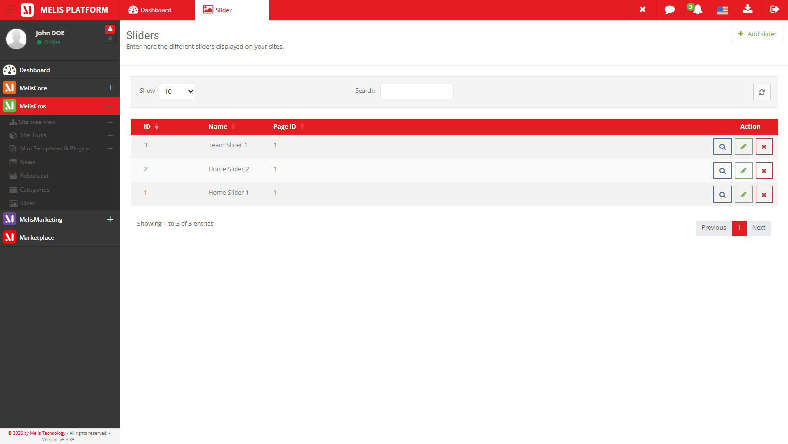
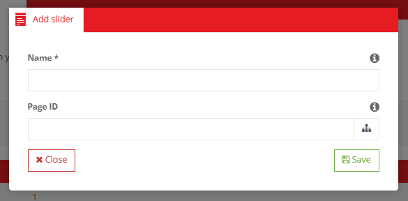
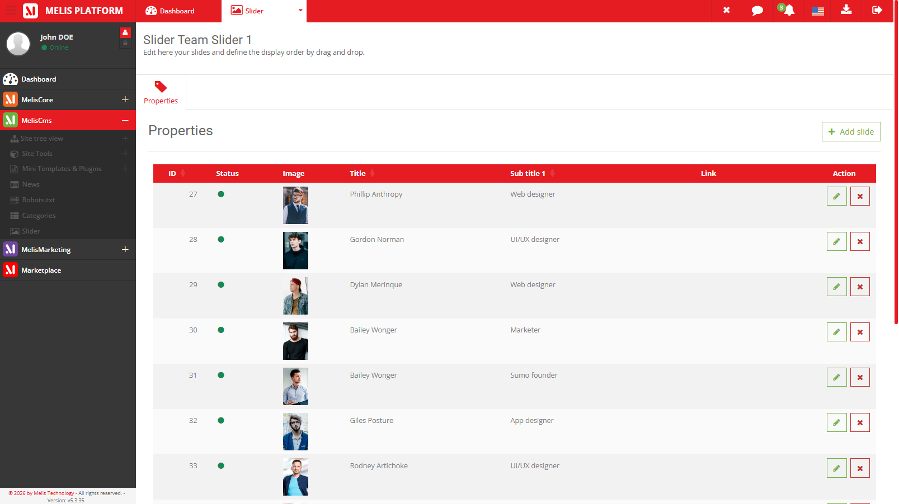
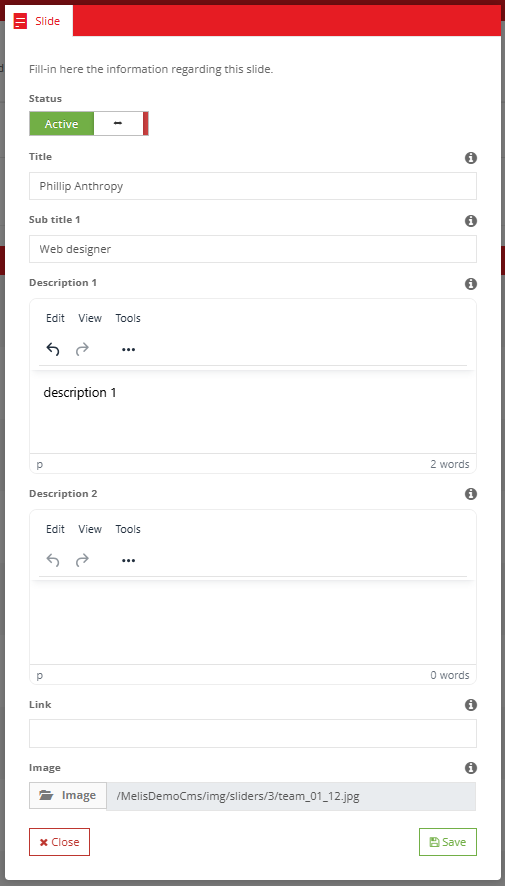
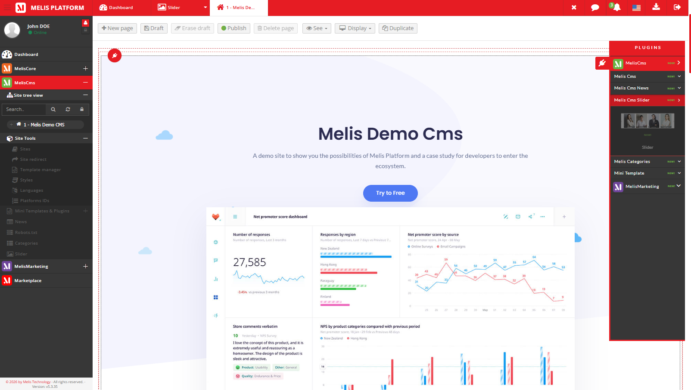

# MelisCmsSlider Module — Functional Documentation (for AI)

> **Purpose of this document**: describe, functionally and technically, the
> `melisplatform/melis-cms-slider` module, so that an AI (or a developer) can understand
> *what the module does*, *which tools it provides*, *how they work* and
> *where the corresponding code lives*.
>
> **Audience**: consumed by the **MelisAI** module (a MelisPlatform module that exposes an
> MCP function to answer user questions). MelisAI fetches this `.md` file and the
> screenshots in `./images/` **on demand** — so the doc is self-contained and §9 acts as
> the filename→content index for retrieving a specific screenshot.
>
> **Status**: reviewed 2026-06-08 against the current source. The module carries no
> semantic version (no `version` in `composer.json`), so treat this doc as describing the
> current `melisplatform/melis-cms-slider` source rather than a tagged release.
>
> Screenshots live in `./images/` (relative paths `./images/...`).

---

## 1. Overview

`MelisCmsSlider` is the **slider / carousel management** module of the Melis platform.
It lets editors build sliders (named carousels) made of ordered slides — each slide
carrying an image, a title, subtitles and a link — from the back-office, then display a
chosen slider on a site's front-office through a templating plugin.

| Item | Value |
|---|---|
| Package name | `melisplatform/melis-cms-slider` |
| Type | `melisplatform-module` |
| PHP namespace | `MelisCmsSlider\` → `src/` (PSR-4) |
| Melis category | `cms` |
| License | OSL-3.0 |
| PHP required | `^8.1 | ^8.3` |
| Framework | Laminas (ex-Zend Framework 2/3), Melis MVC architecture |
| dbdeploy | `true` (DB migrations applied automatically) |

### Dependencies (required Melis modules)

The module does not run standalone. It relies on:

- `melisplatform/melis-core` (`^5.2`) — foundation, general services, events, rights, translations
- `melisplatform/melis-engine` (`^5.2`) — page engine, templates, front rendering
- `melisplatform/melis-front` (`^5.2`) — front-office management
- `melisplatform/melis-cms` (`^5.2`) — CMS, pages, sites management

### Optional integrations — sliders consumed by other modules

> This is the **only** place in this document that describes module-dependent features.
> Everything else documented here is available **by default**. The integrations below are
> **dormant unless the corresponding MelisPlatform module is installed**; when that module
> is active, the integration lights up automatically. MelisCmsSlider is the **provider** of
> a reusable slider selector (the `CmsSliderSelect` form element and the
> `meliscmsslider_select_slider` interface, rendered by `renderSelectSliderAction`), which
> consumer modules embed to attach a slider to their own entities.

- **News** — when `MelisCmsNews` is installed, a news article can be **linked to a slider**
  (slider selector on the news Properties tab, persisted in the news' `cnews_slider_id`
  column). The News module also ships a listener that detaches a slider from any news that
  references it when that slider is deleted.
- **Blog** — when a Blog module is installed, a blog entry can likewise be linked to a
  slider (`cblog_slider_id`), via the `meliscmsslider_select_slider_blog` interface
  (`renderSelectSliderBlogAction`).

When neither consumer module is present, the slider tool and the Show Slider plugin still
work fully on their own.

---

## 2. Functional concepts

A **slider** in Melis is a named container with an optional landing page, holding an
ordered set of **slides** (its "details"):

- **Slider** (the carousel): a name and an optional `page_id` (the page the slider is
  associated with) and a creation date.
- **Slides** (slider details): each slide has a **status** (active/inactive), an **image**,
  a **title**, three **subtitles** (`sub1`, `sub2`, `sub3`), a **link** (URL/target) and an
  **order** (position in the carousel). Slide images are stored under `/media/sliders/`.

A slider has **N slides**; deleting a slider deletes all its slides.

### Data model (MySQL tables)

| Table | Role | Primary key |
|---|---|---|
| `melis_cms_slider` | Slider container (`mcslide_name`, `mcslide_page_id`, `mcslide_date`) | `mcslide_id` |
| `melis_cms_slider_details` | Slides of a slider (status, image, title, sub1-3, link, order) | `mcsdetail_id` |

- The link is `melis_cms_slider_details.mcsdetail_mcslider_id` → `melis_cms_slider.mcslide_id`.
- MySQL Workbench model: `install/sql/model/MelisCmsSliders.mwb`
- Base structure: `install/sql/setup_structure.sql`
- Incremental migrations: `install/dbdeploy/*.sql` (install, update, utf8mb4 conversion)

---

## 3. Tools and elements provided

The module exposes **4 main functional elements**:

1. **The Slider tool (back-office)** — list of sliders + slide management
2. **1 front-office templating plugin** — Show Slider
3. **An application service** reusable by other modules + micro-services
4. **A reusable form element** — `CmsSliderSelect` (slider dropdown for consumer modules)

---

### 3.1 Slider tool (back-office)

Accessible from the Melis back-office left menu, **CMS** tools tree, **Slider manager**
section (icon `fa-image`). Declared in `config/app.interface.php`
(tree `meliscore_leftmenu → meliscms_toolstree_section → melis_cms_slider_tool`).

The tool is a **3-level drill-down**:

1. **Slider list** — every slider on the platform.
2. **A slider** — open one and you land on the slider itself, showing **its list of slides**.
3. **A slide** — each slide is edited in a **modal**.

#### a) Level 1 — the slider list (`MelisCmsSliderList`)

- **Controller**: `src/Controller/MelisCmsSliderListController.php`
- **Table configuration**: `config/app.tools.php` (key `MelisCmsSlider_list`)
- **Views**: `view/melis-cms-slider/melis-cms-slider-list/*.phtml`

Lists **all sliders across the whole platform** — sliders are **global**, not scoped per
site (the `melis_cms_slider` table has no site column; a slider is optionally tied to a
page through `mcslide_page_id`, nothing more). So every slider created on the platform,
whatever site it ends up used on, appears in this single list.

Melis DataTable columns: ID (`mcslide_id`), name (`mcslide_name`), page id
(`mcslide_page_id`). Filters: **limit**, **search**, **refresh**. Data is loaded via AJAX
from `/melis/MelisCmsSlider/MelisCmsSliderList/renderTableListData`
(`renderTableListDataAction`).

Per-row action buttons:
- **Edit / open** (`renderTableListContentActionEditAction`, magnifier icon) — opens the
  slider itself (level 2, its slides).
- **Info** (`renderTableListContentActionInfoAction`).
- **Delete** (`renderTableListContentActionDeleteAction` / `deleteSliderAction`) — removes
  the slider and all its slides.

Creating a slider: the header **Add** button (`renderTableListHeaderRightAddAction`) opens
a small modal (`renderModalFormAction`, form `MelisTechnologySlider_slider_form`) that
defines the **slider container** — `mcslide_name` (required) and `mcslide_page_id`
(optional landing page). The **same modal** is reused to rename/re-point an existing
slider. Saving goes through `saveSliderAction` → `MelisCmsSliderService::saveSlider()`.


*Caption: the Slider list — every slider on the platform; header Add button, limit filter,
search box, the results table (ID, name, page id) and per-row Edit / Info / Delete actions.*


*Caption: the create/rename-slider modal — slider name and the optional associated page id.*

#### b) Level 2 — inside a slider: its slides (`MelisCmsSliderDetails`)

- **Controller**: `src/Controller/MelisCmsSliderDetailsController.php` (the core of the tool)
- **Table configuration**: `config/app.tools.php` (key `MelisCmsSlider_details`)
- **Views**: `view/melis-cms-slider/melis-cms-slider-details/*.phtml`
- **Interface tree**: `config/app.interface.php` (key `MelisCmsSlider`)

Opening (Edit) a slider lands on **the slider's own page**: a single **Properties** tab
(icon `tag`, `render-slider-page-tabs-main`) holding the **slides table** (`#sliderDetails`)
— the list of that slider's slides, with columns: order (drag handle), ID, status, image,
title, sub1, link. Per-row actions: **Info** (`renderSliderContentActionInfoAction`) and
**Delete** (`renderSliderContentActionDeleteAction` / `deleteDetailsAction`).

From this slides list you can:
- **Add a slide**: header **Add** button (`renderSliderTabsContentHeaderAddAction`) opens
  the slide modal (level 3).
- **Reorder slides**: drag-and-drop (`reOrderSliderDetailsAction` →
  `updateSliderDetailsOrdering()`, via the `mcsdetail_order` column).


*Caption: a slider's own page — Properties tab listing that slider's slides (order, id,
status, image, title, sub1, link) with an Add-slide button and per-row Info/Delete.*

#### c) Level 3 — editing a slide (modal)

Each slide is created/edited in a **modal** (`renderModalFormAction`, form
`MelisTechnologySlider_details_form`); saving goes through `saveDetailsFormAction` →
`MelisCmsSliderService::saveSliderDetails()` (image upload to `/media/sliders/`).

Slide fields (`MelisTechnologySlider_details_form`): `mcsdetail_title`, `mcsdetail_sub1`,
`mcsdetail_sub2`, `mcsdetail_sub3`, `mcsdetail_link`, `mcsdetail_img`, `mcsdetail_order`
(plus the slide's active/inactive status).

> Upload limits and the slide image path `/media/sliders/` are configured in
> `config/app.interface.php` (key `MelisCmsSlider.conf.sliders`:
> `minUploadSize`, `maxUploadSize`, `imagesPath`).


*Caption: the add/edit-slide modal — image upload, title, three subtitles, link and the
slide order.*

---

### 3.2 Front-office plugin — Show Slider

A single templating plugin that can be dropped into Melis page templates (`MelisCms`
section of the plugin selector).

- **Role**: renders a **chosen slider** (its active slides, in order) on a front page.
- **Controller Plugin**: `src/Controller/Plugin/MelisCmsSliderShowSliderPlugin.php`
- **View Helper**: `MelisCmsSliderHelper` (alias `MelisCmsSliderPlugin`)
- **Config**: `config/plugins/MelisCmsSliderShowSliderPlugin.config.php`
- **Rendering template**: `view/melis-cms-slider/plugins/showslider.phtml`
- **Front JS**: `public/plugins/js/plugin.cmsSlider.init.js`
- **Config modal — 1 tab**:
  - **Properties** (`MelisCmsSlider/showslider/melis/form`): `template_path` (rendering
    template) and `sliderId` (a `CmsSliderSelect` dropdown to pick which slider to show;
    includes an "open tool" shortcut to jump to the Slider manager)

**How it works**: the plugin's `front()` method resolves the configured `sliderId` and
loads the slider via the service; `createOptionsForms()` / `getFormData()` build the
configuration form; `loadDbXmlToPluginConfig()` / `savePluginConfigToXml()` persist the
plugin config as XML inside the page.

Plugin selector thumbnail: `public/plugins/images/MelisCmsSliderShowSliderPlugin_thumb.jpg`.


*Caption: the Melis page editor's plugin selector (MelisCms section) showing the Show
Slider plugin thumbnail that can be dragged into a page template.*


*Caption: Show Slider › Properties tab — the rendering template and the slider selector
(`CmsSliderSelect`) used to pick which slider to display.*

---

### 3.3 Application service `MelisCmsSliderService`

- **File**: `src/Service/MelisCmsSliderService.php`
- **Service manager alias**: `MelisCmsSliderService`
- Extends `MelisCore\Service\MelisGeneralService` → each method emits `*_start` / `*_end`
  **events** allowing other modules to intercept and alter the data.

Retrieval and usage from another module:

```php
// Obtain the service
$sliderService = $this->getServiceManager()->get('MelisCmsSliderService');

// Get one slider (container + its ordered slides), active slides only
$slider = $sliderService->getSlider($sliderId, 1);

// Get the slider attached to a given page
$slider = $sliderService->getSliderByPageId($pageId, 1);

// Paginated list of sliders
$sliders = $sliderService->getSliderList(0, 10, 'mcslide_id', null);
```

Main public methods:

| Method | Role |
|---|---|
| `getSliderList($start, $limit, $order, $search)` | Filtered/paginated list of sliders (each item includes its slides) |
| `getSlider($sliderId, $status = null)` | One slider as an entity: the container + its ordered slides |
| `getSliderDetails($sliderDetailId)` | One slide (detail) row |
| `getSliderByPageId($pageId, $status = null)` | The slider associated with a page id |
| `saveSlider($slider, $sliderId = null)` | Create (or update if `$sliderId`) a slider container |
| `saveSliderDetails($sliderDetail, $sliderDetailId = null)` | Create (or update) a slide |
| `deleteSlider($sliderId)` | Delete a slider **and all its slides** |
| `deleteSliderDetails($sliderDetailId)` | Delete a single slide |
| `updateSliderDetailsOrdering($sliderDetailId, $mcsdetail_order)` | Update a slide's order |

The `getSlider` / `getSliderByPageId` methods return a `MelisCmsSlider` entity
(`src/Entity/MelisCmsSlider.php`) exposing `getSlider()` (the container row) and
`getSliderDetails()` (the array of slides).

#### Service events

Every method fires a `*_start` event (before execution) and a `*_end` event (after
execution, lets a listener alter `results`).

| Method | Start / End event base |
|---|---|
| `getSliderList` | `meliscmsslider_service_get_slider_list_start` / `_end` |
| `getSlider` | `meliscmsslider_service_get_slider_start` / `_end` |
| `getSliderDetails` | `meliscmsslider_service_get_slider_details_start` / `_end` |
| `getSliderByPageId` | `meliscmsslider_service_get_slider_by_page_id_start` / `_end` |
| `saveSlider` | `meliscmsslider_service_get_slider_details_start` / `_end` ⚠ |
| `saveSliderDetails` | `meliscmsslider_service_save_details_start` / `_end` |
| `deleteSlider` | `meliscmsslider_service_delete_details_start` / `_end` |
| `deleteSliderDetails` | `meliscmsslider_service_delete_details_start` / `_end` |
| `updateSliderDetailsOrdering` | `meliscmsslider_service_delete_details_start` / `_end` ⚠ |

> ⚠ Accuracy note: in the current source, a few write methods **reuse** another method's
> event names — `saveSlider` fires the `get_slider_details` events, and both
> `deleteSliderDetails` and `updateSliderDetailsOrdering` fire the same
> `delete_details` events as `deleteSlider`. A listener attached to
> `meliscmsslider_service_delete_details_*` will therefore also be triggered by slide
> saves' ordering updates. Documented as-is from the code.

#### Tables (Table Gateways)

Declared as aliases in `config/module.config.php`:
`MelisCmsSliderTable` (→ `melis_cms_slider`), `MelisCmsSliderDetailTable`
(→ `melis_cms_slider_details`), in `src/Model/Tables/`.

---

### 3.4 Micro-services (API)

- **File**: `config/app.microservice.php`
- Exposes `MelisCmsSliderService::getSliderList`, `getSlider`, `getSliderDetails` and
  `getSliderByPageId` through the Melis micro-service system (automatic form + input
  filter generation), callable over HTTP POST with parameter validation
  (`start`, `limit`, `order`, `search`, `sliderId`, `status`, `sliderDetailId`, `pageId`).

---

### 3.5 Reusable form element — `CmsSliderSelect`

- **Factory**: `src/Form/Factory/CmsSliderSelectFactory.php`
  (registered as form element `CmsSliderSelect` in `config/module.config.php`)
- A **dropdown of available sliders**. This is the building block other modules embed to
  let a user attach a slider to their own entity (see §1 *Optional integrations*). The Show
  Slider plugin uses it for its `sliderId` field; News/Blog use it on their edit screens.

---

## 4. Extensions and integrations

The module integrates with the Melis back-office through **listeners** registered in
`src/Module.php` (`onBootstrap`), attached only when the current route is the back-office.

### 4.1 Listeners (`src/Listener/`)

| Listener | Role |
|---|---|
| `MelisCmsSliderFlashMessengerListener` | Interface flash messages |
| `MelisCmsSliderServiceMicroServiceListener` | Micro-service exposure of the service methods |
| `MelisCmsSliderTableColumnDisplayListener` | Customizes the list column display |
| `MelisCmsSliderToolCreatorEditionTypeListener` | Integration with the Tool Creator |

### 4.2 Diagnostic

- `config/diagnostic.config.php` — module health checks (integration with the Melis
  diagnostic system).

---

## 5. Front assets

Declared in `config/app.interface.php` (key `ressources`):

- **JS**: `public/js/tools/slider.tool.js` (tool logic),
  `public/assets/switch/bootstrap-switch.js` (status switch)
- **CSS**: `public/css/sliders.css`
- **Compiled bundle** (production, fewer requests):
  `public/build/css/bundle.css`, `public/build/js/bundle.js`
- Front plugin JS: `public/plugins/js/plugin.cmsSlider.init.js`

---

## 6. Internationalization

- Translation files: `language/en_EN.interface.php`, `language/fr_FR.interface.php`
- All interface keys use the `tr_MelisCmsSlider*` / `tr_MelisCmsSliderDetails*` prefixes.
- Translation loading: `Module::createTranslations()` (based on the Melis locale, with
  possible override via `MelisModuleConfig`).

---

## 7. Quick code map

```
melis-cms-slider/
├── composer.json                 → module dependencies & metadata (dbdeploy: true)
├── config/
│   ├── module.config.php         → routes, services, controllers, plugin, form element, view helper
│   ├── app.interface.php         → back-office interface tree (menu, slider page, Properties tab, modals)
│   ├── app.tools.php             → the two DataTables (sliders list + slides list)
│   ├── app.forms.php             → forms (slider, slide details, slider selectors)
│   ├── app.microservice.php      → micro-service exposure (getSliderList/getSlider/…)
│   ├── diagnostic.config.php     → diagnostic tests
│   └── plugins/                  → Show Slider plugin config
├── src/
│   ├── Module.php                → bootstrap, listeners, translations, getConfig()
│   ├── Controller/               → SliderListController, SliderDetailsController, MelisSetupController, Plugin/
│   ├── Service/                  → MelisCmsSliderService
│   ├── Entity/                   → MelisCmsSlider (container + slides)
│   ├── Model/Tables/             → MelisCmsSliderTable, MelisCmsSliderDetailTable
│   ├── Listener/                 → listeners (flash, micro-service, table column, tool creator)
│   ├── Form/Factory/             → CmsSliderSelectFactory (slider dropdown)
│   └── View/Helper/              → MelisCmsSliderHelper (Show Slider view helper)
├── view/                         → .phtml templates (back-office + front plugin)
├── public/                       → JS/CSS assets, bundles, plugin image/JS
├── language/                     → en_EN / fr_FR translations
├── install/                      → SQL (structure, MWB model, dbdeploy migrations)
└── etc/                          → MarketPlace (images/xml) + MelisAI/doc (this doc)
```

---

## 8. Typical slider lifecycle

1. **Create the slider**: back-office → Slider manager → *Add* → name (+ optional landing
   page) → `saveSliderAction` → `saveSlider()` → `melis_cms_slider`.
2. **Add slides**: edit the slider → Properties tab → *Add* slide → fill image, title,
   subtitles, link, order → `saveDetailsFormAction` → `saveSliderDetails()` →
   `melis_cms_slider_details`.
3. **Order & activate**: drag-reorder slides (`updateSliderDetailsOrdering`), toggle each
   slide's status.
4. **Display on the front**: drop the **Show Slider** plugin into a page template and pick
   the slider via the `CmsSliderSelect` dropdown.
5. **(Optional) Attach to a news/blog entry**: with `MelisCmsNews` / a Blog module
   installed, select the slider on the entry's edit screen (see §1 *Optional integrations*).
6. **Deletion**: `deleteSlider()` removes the slider **and all its slides**.

---

## 9. Screenshot index (for on-demand retrieval)

All screenshots live in `./images/` (i.e. `/etc/MelisAI/doc/images/`). This table is the
**filename → content** index the MelisAI MCP uses to fetch a specific screenshot on demand;
each row's caption in the body gives the text-only description of what the image shows.

| Image file | Content |
|---|---|
| `meliscmsslider-tool-slider-list.png` | Slider list — the tool's landing page (table, filters, actions) |
| `meliscmsslider-tool-slider-new.png` | Create/edit-slider modal (name + landing page id) |
| `meliscmsslider-tool-slider-edit-slidelist-tab-properties.png` | Slider details editor — Properties tab with the slides table |
| `meliscmsslider-tool-slider-edit-properties-slide-edit.png` | Add/edit-slide modal (image, title, subtitles, link, order) |
| `meliscmsslider-page-menu-plugins-selector.png` | Show Slider plugin in the page editor's plugin selector |
| `meliscmsslider-page-plugin-slider-config-properties-tab.png` | Show Slider plugin config — Properties tab |

---

*Document for AI consumption (MelisAI MCP) — describes the `melisplatform/melis-cms-slider`
module. Last reviewed 2026-06-08 against the current source.*
